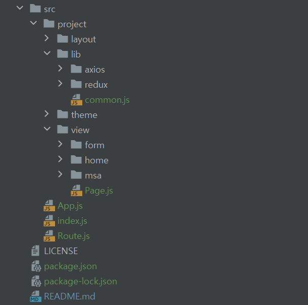

# temp.react
React Basic Framework (ver 0.1)

## ● setup [IntelliJ 기준]
    1. nodeJS 다운로드
      - package.json 우클릭 > Run 'npm install'

    2. 패키지 추가 설치 
      - package.json 파일 내 dependencies 추가
      - package.json build 실행 (npm run build)

    3. 서비스 시작
      - package.json start 실행 (npm run start)

## ● structure

- layout : 전체 레이어 템플릿
- lib : 공통 (module, util, axios, redux)
- theme : 공통 UI 스타일(테마) 적용
- view : 업무 개발
- index.js : 시작 페이지
- Route.js : URI 라우터

## ● Reference
1) React - React 기본 가이드 (ES6 문법, hook 기능 사용)

   https://ko.reactjs.org/docs/getting-started.html

2) MUI (UI) - 화면 UI 구성을 위한 도구

    https://mui.com/

3) Axios - 비동기 통신을 위한 도구

    https://axios-http.com/kr/docs/intro

4) Redux - 데이터 상태 관리 도구

   https://ko.redux.js.org/introduction/getting-started/
    